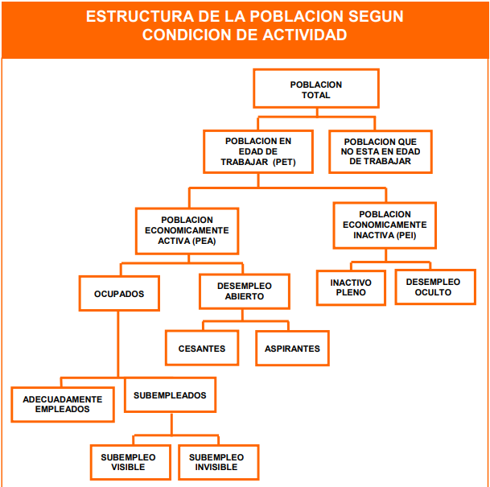

# 0. Cargar paquetes

Se utilizaron los siguientes paquetes para la importación (`readxl`),
manipulación (`tidyverse`) y personalización (`hrbrthemes`, `ggrepel`,
`plotly`) de los datos.

```{r message=FALSE, warning=FALSE}
library(readxl)
library(tidyverse)
library(hrbrthemes)
library(ggrepel)
library(plotly)
```

# 1. Base de datos

Exportamos la data con el paquete `readxl`

```{r}
total     <- read_xlsx("INEI_data.xlsx", sheet = "Total")
sexo      <- read_xlsx("INEI_data.xlsx", sheet = "Sexo")
ambito    <- read_xlsx("INEI_data.xlsx", sheet = "Ámbito")
educacion <- read_xlsx("INEI_data.xlsx", sheet = "Educación")
edad      <- read_xlsx("INEI_data.xlsx", sheet = "Edad")
```

# 2. Preparar data

Redondeamos todas las variables númericas con la función *mutate* del
paquete `dplyr`

```{r}
total     <- total %>% mutate_if(is.numeric, round)
sexo      <- sexo %>% mutate_if(is.numeric, round)
educacion <- educacion %>% mutate_if(is.numeric, round)
ambito    <- ambito %>% mutate_if(is.numeric, round)
edad      <- edad %>% mutate_if(is.numeric, round)
```

# 3. Visualizar data

Los siguientes gráficos fueron elaborados con el paquete `ggplot2`, y
personalizados con las extensiones `hrbrthemes` y `ggrepel`.

## 3.1 Empleo y desempleo

### Glosario de términos

+-----------------------------------+-----------------------------------+
| VARIABLE[^1]                      | **DEFINICIÓN**                    |
+:==================================+:==================================+
| Población en edad de trabajar     | Población definida como apta en   |
| (PET)                             | cuanto a edad para ejercer        |
|                                   | funciones productivas (de 14 años |
|                                   | y más de edad)                    |
+-----------------------------------+-----------------------------------+
| Población económicamente activa   | Personas, que contando con la     |
| (PEA)                             | edad mínima establecida , ofrecen |
|                                   | la mano de obra disponible para   |
|                                   | la producción de bienes y/o       |
|                                   | servicios durante un tiempo       |
|                                   | determinado                       |
+-----------------------------------+-----------------------------------+
| *Tasa de ocupación*               | Proporción de la PEA (población   |
|                                   | económicamente activa) respecto   |
|                                   | de la PET (población en edad de   |
|                                   | trabajar)                         |
+-----------------------------------+-----------------------------------+
| PEA Ocupada                       | Personas que, contando con la     |
|                                   | edad mínima especificada, se      |
|                                   | encontraban realizando algún      |
|                                   | trabajo durante el período de     |
|                                   | referencia                        |
+-----------------------------------+-----------------------------------+
| *Tasa de empleo*                  | Proporción de la población        |
|                                   | ocupada respecto de la PEA        |
|                                   | (población económicamente activa) |
+-----------------------------------+-----------------------------------+
| PEA Desocupada o Desempleo        | Este concepto abarca tanto a      |
| abierto                           | personas que buscaron trabajo     |
|                                   | pero que trabajaron antes         |
|                                   | (cesantes), como a los que        |
|                                   | buscaron trabajo por primera vez  |
|                                   | (aspirantes)                      |
+-----------------------------------+-----------------------------------+
| *Tasa de desempleo abierto*       | Proporción de personas            |
|                                   | desempleadas o desocupadas, que   |
|                                   | están buscando activamente un     |
|                                   | empleo, entre la PEA              |
+-----------------------------------+-----------------------------------+

[^1]: INEI:
    <https://www.inei.gob.pe/media/MenuRecursivo/publicaciones_digitales/Est/Lib1676/06.pdf>



### **Evolución de tasa de ocupación**

```{r, echo = FALSE, warning = FALSE, out.width="100%"}
g1 <- total %>% 
  ggplot(aes(x = year)) +
  geom_line(aes(y = tasa_ocupación), size = 0.8, col = "#FFA45E") +
  geom_line(aes(y = tasa_PET), size = 0.8, col = "#543884") +
  geom_line(aes(y = tasa_desempleo_abierto), size = 0.8) +
  labs(title = "Evolución de la PET, PEA y PEA desocupada",
       x = NULL,
       y = "(%)",
       caption = "Elaborado por Decision Lab PUCP \n Equipo de Investigación") +
  theme_ipsum_tw() +
  theme(legend.position = "top") +
  scale_y_continuous(limits = c(0,100),
                     breaks = seq(0,100,10)) + 
  scale_x_continuous(breaks = seq(2004,2020,2)) 
```

```{r, echo = FALSE, warning = FALSE, out.width="100%"}
ggplotly(g1)
```

### **Evolución de tasa de ocupación según sexo**

> Se observa una amplia brecha entre hombres y mujeres (alrededor de 17
> pp), la cual aumenta en 2pp el último año.

```{r, echo = FALSE, warning = FALSE, out.width="100%"}
sexo %>% 
  ggplot(aes(x = year, 
             y = tasa_ocupación,
             col = SEXO)) +
  geom_line(size = 0.8) +
  geom_point(size = 2) +
  geom_label(aes(label = tasa_ocupación),
             show.legend = FALSE) +
  scale_color_manual(values = c("#FFA45E","#EC4176"),
                     name = "Sexo", 
                     labels = c("Hombre", "Mujer"))  +
  labs(title = "Evolución de la PEA según sexo (2004-2020)",
       x = NULL,
       y = "Tasa de Ocupación (%)",
       caption = "Elaborado por Decision Lab PUCP \n Equipo de Investigación") +
  theme_ipsum_tw() +
  theme(legend.position = "top") +
  scale_y_continuous(limits = c(45,85),
                     breaks = seq(50,80,10)) + 
  scale_x_continuous(breaks = seq(2004,2020,2)) +
  ggsave("02_lineas.png", height = 5.89, width = 10)
```

### **Evolución de tasa de desempleo abierto según sexo**

> Se observan valores similares entre hombres y mujeres. Asimismo, la
> variación en el último año es equivalente en ambos (alrededor de 3pp).

```{r, echo = FALSE, warning = FALSE, out.width="100%"}
sexo %>% 
  ggplot(aes(x = year, 
             y = tasa_desempleo_abierto,
             color = SEXO)) +
  geom_line(size = 0.7) +
  geom_point(size = 2) +
  geom_label(aes(label = tasa_desempleo_abierto),
             show.legend = FALSE) +
  scale_color_manual(values = c("#FFA45E","#543884"),
                     name = "Sexo", 
                     labels = c("Hombre", "Mujer"))  +
  labs(title = "Evolución de desempleo abierto según sexo",
       x = NULL,
       y = "Tasa de Ocupación (%)",
       caption = "Elaborado por Decision Lab PUCP \n Equipo de Investigación") +
  theme_ipsum_rc() +
  theme(legend.position = "top") +
  scale_y_continuous(limits = c(2,8)) +
  scale_x_continuous(breaks = seq(2004,2020,2)) +
  ggsave("02_lineas.png", height = 5.89, width = 10)
```

### **Evolución de tasa de ocupación según ámbito geográfico**

> Se observa menores índices de ocupación (menores a 70 pp) en personas
> de zonas rurales. Estos bajos índices disminuyen aún más en el último
> año (caída alredor de 13pp).

```{r, echo = FALSE, warning = FALSE, out.width="100%"}
ambito %>% 
  ggplot(aes(x = year, 
             y = tasa_ocupación,
             col = ambito)) +
  geom_line(size = 0.8) +
  geom_point(size = 2) +
  geom_label(aes(label = tasa_ocupación),
             show.legend = FALSE) +
  scale_color_manual(values = c("#FFA45E","#EC4176"),
                     name = "Ámbito", 
                     labels = c("Urbano", "Rural"))  +
  labs(title = "Evolución de la PEA según ámbito (2004-2020)",
       x = NULL,
       y = "Tasa de Ocupación (%)",
       caption = "Elaborado por Decision Lab PUCP \n Equipo de Investigación") +
  theme_ipsum_tw() +
  theme(legend.position = "top") +
  scale_y_continuous(limits = c(50,90),
                     breaks = seq(50,90,10)) + 
  scale_x_continuous(breaks = seq(2004,2020,2)) 
```

### **Evolución de tasa de ocupación según nivel educativo**

> Se observa menores índices de ocupación (menores a 60 pp) en personas
> con educación universitaria, seguidos por personas sin nivel
> educativo. Estos bajos índices disminuyen aún más en el último año
> (caída alredor de 11pp).

```{r, echo = FALSE, warning = FALSE, out.width="100%"}
educacion <- educacion %>% 
  mutate(should_be_labeled = 
           ifelse(year %in% seq (2004,2020,2),
                  TRUE, FALSE))

educacion %>% 
  ggplot(aes(x = year, 
             y = tasa_ocupación,
             col = `nivel educativo`)) +
  geom_line(size = 0.8) +
  geom_point(size = 2) +
  geom_label(
    data = filter(educacion,
                  should_be_labeled == TRUE),
    aes(label = tasa_ocupación),
    show.legend = FALSE) +
  labs(title = "Evolución de la PEA según nivel educativo",
       x = NULL,
       y = "Tasa de Ocupación (%)",
       caption = "Elaborado por Decision Lab PUCP \n Equipo de Investigación") +
  theme_ipsum_tw() +
  theme(legend.position = "top") +
  scale_y_continuous(limits = c(43,80),
                     breaks = seq(40,80,10)) + 
  scale_x_continuous(breaks = seq(2004,2020,2))
```

### **Evolución de tasa de ocupación según grupo etario**

> Se observa menores índices de ocupación (menores a 50 pp) en adultos
> mayores, seguidos por jóvenes. Estos bajos índices disminuyen aún más
> en el último año (caída alredor de 6pp).

```{r, echo = FALSE, warning = FALSE, out.width="100%"}
edad <- edad %>% 
  mutate(should_be_labeled = 
           ifelse(year %in% seq (2004,2020,2),
                  TRUE, FALSE))

edad %>% 
  ggplot(aes(x = year, 
             y = tasa_ocupación,
             col = edad)) +
  geom_line(size = 0.8) +
  geom_point(size = 2) +
  geom_label(
    data = filter(edad,
                  should_be_labeled == TRUE),
    aes(label = tasa_ocupación),
        show.legend = FALSE) +
  labs(title = "Evolución de la PEA según grupo etario",
       x = NULL,
       y = "Tasa de Ocupación (%)",
       caption = "Elaborado por Decision Lab PUCP \n Equipo de Investigación") +
  theme_ipsum_tw() +
  theme(legend.position = "top") +
  scale_y_continuous(limits = c(30,90),
                     breaks = seq(30,90,10)) + 
  scale_x_continuous(breaks = seq(2004,2020,2))
```

## 3.2 Formalidad e informalidad

### Glosario de términos

+-----------------------------------+-----------------------------------+
| **VARIABLE**                      | **DEFINICIÓN**                    |
+:==================================+:==================================+
| Empleo formal                     | Comprende el total de empleos en  |
|                                   | empresas que cumplen con las      |
|                                   | normas establecidas por el Estado |
+-----------------------------------+-----------------------------------+
| Empleo informal                   | Comprende el total de empleos     |
|                                   | informales, ya sea en empresas    |
|                                   | del sector formal, empresas del   |
|                                   | sector informal, o en hogares     |
+-----------------------------------+-----------------------------------+
| Empleo informal en el sector      | Trabajadores en empresas sin      |
| informal                          | personalidad jurídica que no      |
|                                   | están registradas o que son       |
|                                   | pequeñas                          |
+-----------------------------------+-----------------------------------+
| Empleo informal fuera del sector  | Trabajadores en empresas formales |
| informal                          | y no cubiertos por la protección  |
|                                   | social, así como las trabajadoras |
|                                   | del hogar, los jornaleros         |
|                                   | ocasionales y los trabajadores    |
|                                   | familiares                        |
+-----------------------------------+-----------------------------------+

### **Evolución de la tasa de empleo informal según sexo**

> Se observa una brecha entre hombres y mujeres (alrededor de 7 pp). En
> el último año, se observa que esta se reduce a 3pp a raíz de un
> aumento de la informalidad en hombres.

```{r, echo = FALSE, warning = FALSE, out.width="100%"}
sexo %>% 
  ggplot(aes(x = year, 
             y = `Tasa de empleo informal`,
             col = SEXO)) +
  geom_line(size = 0.8) +
  geom_point(size = 2) +
  geom_label(aes(label = `Tasa de empleo informal`),
             show.legend = FALSE) +
  scale_color_manual(values = c("#FFA45E","#EC4176"),
                     name = "Sexo", 
                     labels = c("Hombre", "Mujer"))  +
  labs(title = "Evolución del empleo informal según sexo",
       x = NULL,
       y = "Tasa de Informalidad (%)",
       caption = "Elaborado por Decision Lab PUCP \n Equipo de Investigación") +
  theme_ipsum_tw() +
  theme(legend.position = "top") +
  scale_y_continuous(limits = c(65,85),
                     breaks = seq(65,85,10)) + 
  scale_x_continuous(limits = c(2007,2020),
                     breaks = seq(2008,2020,2)) 
```

### **Evolución de la tasa de empleo informal según ámbito geográfico**

> Se observa una amplia brecha entre las personas de origen rural y
> urbano (cercanos a 30 pp). Sin embargo, no se encuentra una variación
> considerable de la brecha por la pandemia (29 vs 28 pp).

```{r, echo = FALSE, warning = FALSE, out.width="100%"}
ambito %>% 
  ggplot(aes(x = year, 
             y = `Tasa de empleo informal`,
             col = ambito)) +
  geom_line(size = 0.8) +
  geom_point(size = 2) +
  geom_label(aes(label = `Tasa de empleo informal`),
             show.legend = FALSE) +
  scale_color_manual(values = c("#EC4176","#FFA45E"),
                     name = "Ámbito", 
                     labels = c("Rural", "Urbano"))  +
  labs(title = "Evolución del empleo informal según ámbito geográfico",
       x = NULL,
       y = "Tasa de Informalidad (%)",
       caption = "Elaborado por Decision Lab PUCP \n Equipo de Investigación") +
  theme_ipsum_tw() +
  theme(legend.position = "top") +
  scale_y_continuous(limits = c(60,100),
                     breaks = seq(60,100,10)) + 
  scale_x_continuous(limits = c(2007,2020),
                     breaks = seq(2008,2020,2)) 
```

### **Evolución de la tasa de empleo informal según nivel educativo**

> Se observa mayores índices de empleo informal (mayores a 90 pp) en
> personas sin nivel educativo o solo con primaria completa. Sin
> embargo, el impacto por la pandemia es mayor en personas con educación
> universitaria (7 pp)

```{r, echo = FALSE, warning = FALSE, out.width="100%"}
educacion %>% 
  ggplot(aes(x = year, 
             y = `Tasa de empleo informal`,
             col = `nivel educativo`)) +
  geom_line(size = 0.8) +
  geom_point(size = 2) +
  geom_label(aes(label = `Tasa de empleo informal`),
             show.legend = FALSE) +
  scale_color_manual(values = c("#FFA45E",
                                "#9B77CF",
                                "#EC4176",
                                "#543884",
                                "#A13770"),
                     name = "Nivel Educativo", 
                     labels = c("Primaria",
                                "Secundaria",
                                "Sin Nivel",
                                "Superior No Universitaria",
                                "Superior Universitaria")) +
  labs(title = "Evolución del empleo informal según nivel educativo",
       x = NULL,
       y = "Tasa de Informalidad (%)",
       caption = "Elaborado por Decision Lab PUCP \n Equipo de Investigación") +
  theme_ipsum_tw() +
  theme(legend.position = "top") +
  scale_y_continuous(limits = c(60,100),
                     breaks = seq(60,100,10)) + 
  scale_x_continuous(limits = c(2007,2020),
                     breaks = seq(2008,2020,2)) 
```

### **Evolución de la tasa de empleo informal según grupo etario**

> Se observa mayores índices de empleo informal (cercanos a 90 pp) en
> los adultos mayores, seguidos por los jóvenes.

```{r, echo = FALSE, warning = FALSE, out.width="100%"}
edad %>% 
  ggplot(aes(x = year, 
             y = `Tasa de empleo informal`,
             col = edad)) +
  geom_line(size = 0.8) +
  geom_point(size = 2) +
  geom_label(aes(label = `Tasa de empleo informal`),
             show.legend = FALSE) +
  labs(title = "Evolución del empleo informal según grupo etario",
       x = NULL,
       y = "Tasa de Informalidad (%)",
       caption = "Elaborado por Decision Lab PUCP \n Equipo de Investigación") +
  theme_ipsum_tw() +
  theme(legend.position = "top") +
  scale_y_continuous(limits = c(60,100),
                     breaks = seq(60,100,10)) + 
  scale_x_continuous(limits = c(2007,2020),
                     breaks = seq(2008,2020,2)) 
```
